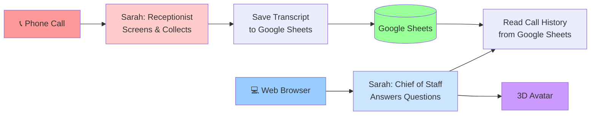

# LiveKit Voice Agent Architecture

## Simple Explanation

**Two ways to connect:**
- 📞 **Phone**: Sarah screens calls and saves messages to Google Sheets
- 💻 **Web**: Sarah answers questions and can read saved call history

**One storage system:**
- All phone call transcripts are saved in Google Sheets
- Web mode can retrieve and summarize this history

