# LiveKit Voice Agent Architecture

```mermaid
flowchart LR
    Phone[📞 Phone Call] --> Sarah1[Sarah: Receptionist<br/>Screens & Collects]
    Web[💻 Web Browser] --> Sarah2[Sarah: Chief of Staff<br/>Answers Questions]
    
    Sarah1 --> Save[Save Transcript<br/>to Google Sheets]
    Sarah2 --> Read[Read Call History<br/>from Google Sheets]
    
    Save --> Sheets[(Google Sheets)]
    Sheets --> Read
    
    Sarah2 --> Avatar[3D Avatar]
    
    style Phone fill:#ff9999
    style Web fill:#99ccff
    style Sarah1 fill:#ffcccc
    style Sarah2 fill:#cce5ff
    style Sheets fill:#99ff99
    style Avatar fill:#cc99ff
```

## Simple Explanation

**Two ways to connect:**
- 📞 **Phone**: Sarah screens calls and saves messages to Google Sheets
- 💻 **Web**: Sarah answers questions and can read saved call history

**One storage system:**
- All phone call transcripts are saved in Google Sheets
- Web mode can retrieve and summarize this history

